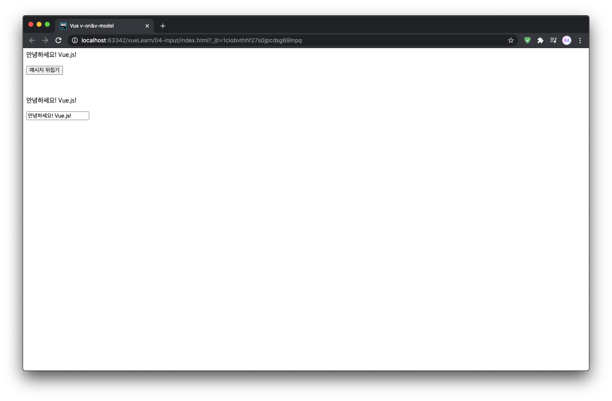
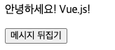
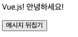
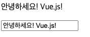
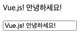

#Learn-Vue.js - v-on, v-model 사용자 입력 핸들링

(사진처럼 텍스트와 버튼, 텍스트와 텍스트박스가 나온다.)

(먼저 위쪽에 있는 메시지 뒤집기 버튼을 한 번 눌러보자.)

(메시지 뒤집기 버튼을 누르면, 공백으로 텍스트의 위치가 반대로 바뀐다.)
(다시 누르면 원래대로 돌아온다.)

 

---

 

(이번에는 밑에있는 텍스트박스의 텍스트값을 변경해보자.)

(기존의 텍스트를 지우고 새로 써보았더니, 위에 텍스트가 텍스트박스의 값과 똑같이 변하게된다.)
